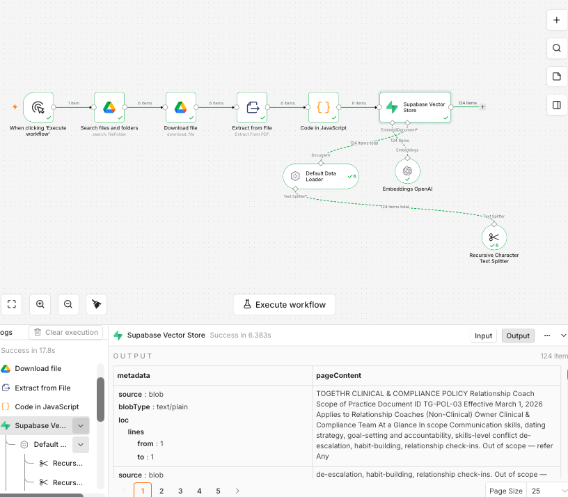
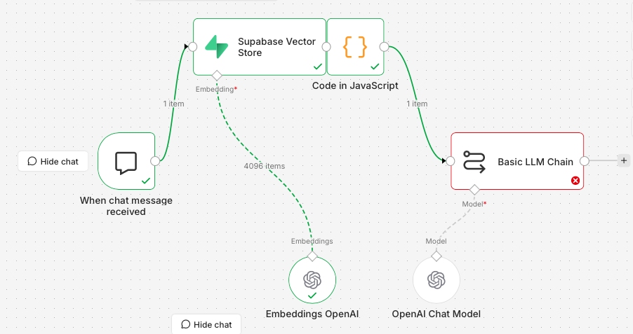
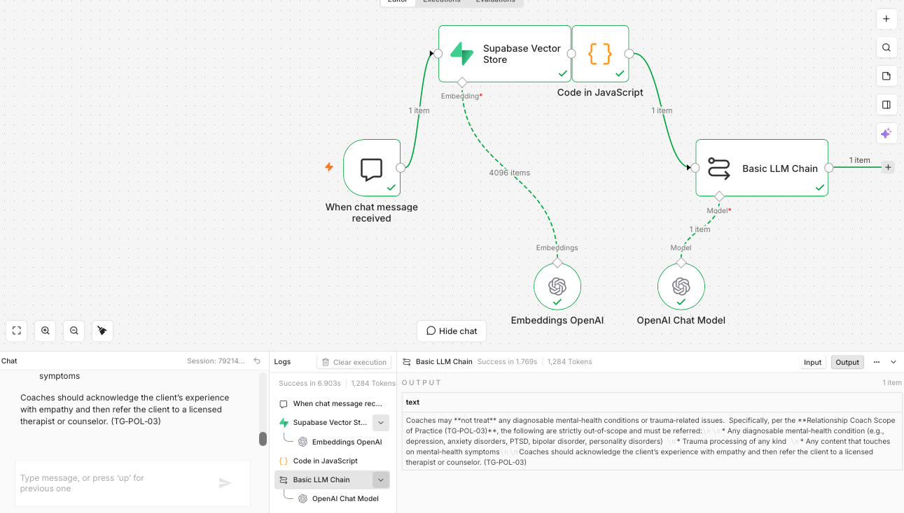

# Togethr Compliance Assistant — Enterprise Policy Q&A Bot

A Retrieval-Augmented Generation (RAG) system that helps therapists, counselors, and coaches on the Togethr platform get accurate, cited answers to company policy questions — built for **Week 2** of The Gen Academy's Mastering Agentic AI Bootcamp.

**One-liner:** *My RAG app helps the therapists on my platform answer questions around compliance and anything else from company documents (5–10 PDF files) in Google Drive with 99% faithfulness.*

This is **Project 1: Enterprise Policy Q&A Bot**, built with **n8n**, **Nebius AI Studio** (embeddings + generation), and **Supabase** (pgvector).

---

## Result

**15/15 (100%)** on the formal evaluation set — see [`eval_15_questions.md`](./eval_15_questions.md) for the full question-by-question log, including a real bug found and fixed mid-evaluation, and an honestly-documented model limitation left as-is.

---

## Architecture

Two separate n8n workflows:

**1. Ingestion** — loads the policy PDFs into a searchable database, run once (or whenever policies change):

```
Google Drive (search folder)
  → Google Drive (download each file)
  → Extract from File (PDF → text)
  → Code (clean repeated headers/footers, extract filename)
  → Supabase Vector Store [Insert Documents]
      ├─ Embeddings: Nebius (Qwen/Qwen3-Embedding-8B)
      └─ Document Loader (with doc_name metadata)
          └─ Text Splitter (Recursive Character, 400 chars / 75 overlap)
```

**2. Query** — answers questions in real time:

```
Chat Trigger
  → Supabase Vector Store [Get ranked documents] (top 8, dense retrieval)
      └─ Embeddings: Nebius (Qwen/Qwen3-Embedding-8B)
  → Code (combine 8 chunks into one context block, tagged with source doc_name)
  → Basic LLM Chain [system prompt below]
      └─ Chat Model: Nebius (openai/gpt-oss-120b)
```

---

## Key screenshots

**Ingestion workflow — full run, 124 chunks successfully embedded and stored:**



**Query workflow — final wiring:**



**Example of a grounded, cited answer in action:**



---

## Setup steps (to reproduce this project)

### 1. Corpus
- 6 synthetic policy PDFs (Therapist/Counselor/Coach Scope of Practice, Referral Protocol, Emergency Protocol, Professional Conduct) — see `/policies` in this repo.
- Uploaded to a dedicated Google Drive folder.

### 2. Supabase
- Create a project, enable the `vector` extension (Database → Extensions).
- Run the SQL in [`supabase_setup.sql`](./supabase_setup.sql) to create the `documents` table and `match_documents` search function.
- Grant sequence permissions: `grant usage, select on all sequences in schema public to service_role;`
- Expose the `documents` table and `match_documents` function via Data API → Settings.
- Use the **legacy `service_role` JWT key** (not the newer `sb_secret_...` format) for the n8n credential — the newer key format wasn't compatible with n8n's Supabase node at time of building.

### 3. Nebius
- Create an API key in Nebius AI Studio (Token Factory).
- Base URL: `https://api.tokenfactory.nebius.com/v1/`
- Embeddings model: `Qwen/Qwen3-Embedding-8B` (4096 dimensions — must match the Supabase table's vector column size)
- Chat model: `openai/gpt-oss-120b`
- Both configured via n8n's standard **OpenAI-compatible** credential type, pointed at Nebius's base URL.

### 4. n8n
- Import [`ingestion_workflow.json`](./ingestion_workflow.json) and [`query_workflow.json`](./query_workflow.json).
- Reconnect credentials (Google Drive OAuth, Supabase, Nebius) — these aren't exported with the workflow for security.
- Run the ingestion workflow once to populate Supabase.
- Open the Query workflow's chat panel to test.

---

## Why we made these choices

**n8n over Lyzr:** n8n had a ready-made solution pattern for this exact use case (policy Q&A over Drive-hosted PDFs) and native nodes for every step of the pipeline (Google Drive, Vector Store, AI/LangChain nodes). Lyzr's templates at the time were oriented toward financial document intelligence and customer support, not policy Q&A specifically.

**Nebius over OpenAI:** existing credits, and Nebius exposes an OpenAI-compatible API, so it slots directly into n8n's standard OpenAI-style nodes with no special integration work — just a different base URL and model string.

**Supabase (pgvector) over a dedicated vector DB:** free tier, SQL-native (useful for a first RAG project to see the actual mechanics rather than a black-box vector store), and the developer had prior light exposure to Supabase.

**Dense retrieval only, no reranking:** the original plan called for Cohere reranking to help distinguish the three near-identical scope-of-practice documents. In practice, testing showed dense retrieval alone already cleanly separated Coach/Counselor/Therapist content (see the retrieval-only test during Step 8) — adding a reranking step wasn't justified by the evidence, so it was deliberately left out to keep the pipeline simpler. This is a good example of letting real test results override an upfront assumption in the plan.

**Chunking (400 chars / 75 overlap), heading-aware:** small enough for precise retrieval on specific policy questions, with enough overlap to avoid splitting a clause mid-sentence. The 6 documents were written with explicit section headers specifically so this would work well.

**Two-layer refusal design:** the system prompt has both a standard "I don't know" refusal for out-of-scope questions, and a separate, non-negotiable crisis carve-out — if a question describes an active emergency rather than a policy lookup, the bot skips generation entirely and returns a fixed safety message pointing to the real Emergency Protocol, rather than letting a live crisis situation depend on retrieval quality.

---

## Known limitations (from the evaluation)

1. **Intermittent document-ID mislabeling** — occasionally, when citing the Counselor Scope of Practice document, the model would attach the wrong policy ID (confusing it with a document it internally cross-references). Observed twice in 15 questions, did not recur afterward. Left as a documented limitation rather than "fixed," since it's a model reasoning quirk rather than an infrastructure bug.
2. **Ambiguous-question completeness gap** — on questions where 2+ documents were equally relevant, the bot sometimes surfaced only one and silently omitted another equally-applicable one. Information given was always accurate, just occasionally incomplete.

Full details and the question-by-question log: [`eval_15_questions.md`](./eval_15_questions.md).

---

## Project structure

```
/policies/                    — the 6 source PDFs
/assets/                      — screenshots used in this README
ingestion_workflow.json       — n8n ingestion workflow export
query_workflow.json           — n8n query workflow export
supabase_setup.sql            — table + function + permissions SQL
eval_15_questions.md          — full evaluation log
README.md                     — this file
```
